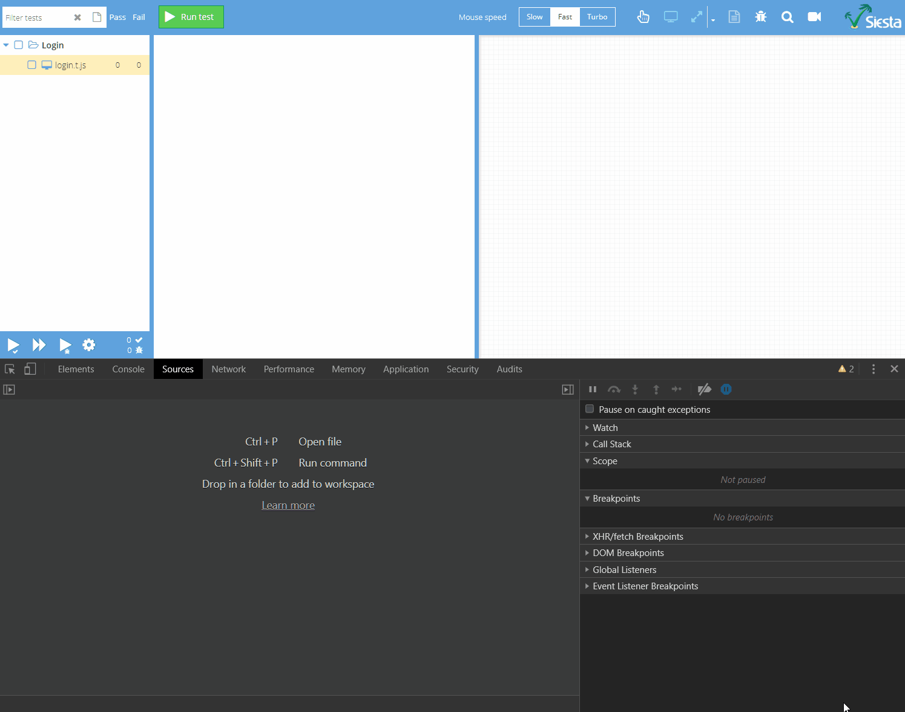

# Bryntum Siesta Demo

Basic demonstration of [Bryntum Siesta](https://www.bryntum.com/products/siesta/) as a
web app testing tool. Shows how to wire up Siesta inside an app and start testing its UI.

Pretty much drop in the `siesta` folder in your app, tweak `pageUrl` and `npm install`
in the `siesta` folder to use in any web app.

